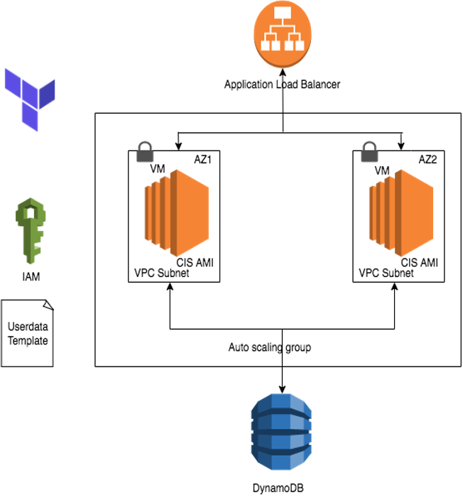

# Startup Sample Application - Virtual Machines

## Virtual Machines Application Architecture



## Setup

- Fork this repo
- Enable github actions

### Github Variables

This repository use [Github OpenID Connect](https://docs.github.com/en/actions/deployment/security-hardening-your-deployments/configuring-openid-connect-in-amazon-web-services) to authenticate directly to AWS assuming an IAM role.

The required environment variables are:

- `TERRAFORM_DEPLOY_ROLE_ARN` This is the ARN of IAM Role used to deploy resources through the Github action authenticate with the GitHub OpenID Connect. You also need to link that role to the correct IAM Policy.
  - To access the `TERRAFORM_DEPLOY_ROLE_ARN` you need to create it beforehand manually in each account. Then you have to add the right arn for each Github environment.
  To create it you need can use this example of thrust relationship :

```json
{
  "Version": "2012-10-17",
  "Statement": [
      {
          "Effect": "Allow",
          "Principal": {
              "Federated": "arn:aws:iam::<accound_id>:oidc-provider/token.actions.githubusercontent.com"
          },
          "Action": "sts:AssumeRoleWithWebIdentity",
          "Condition": {
              "StringLike": {
                  "token.actions.githubusercontent.com:sub": "repo:<Github_organization>/<repo_name>:ref:refs/heads/<Your_branch>"
              },
              "ForAllValues:StringEquals": {
                  "token.actions.githubusercontent.com:iss": "https://token.actions.githubusercontent.com",
                  "token.actions.githubusercontent.com:aud": "sts.amazonaws.com"
              }
          }
      }
  ]

}
```

The following variables they are global for every account so you can put them as Github repository _variables__

- `LICENCEPLATE` is the 6 character licence plate associated with your project set e.g. `abc123`
- `S3_BACKEND_NAME` is the name of the S3 Bucket name used to store the Terraform state.

## Github Action Workflows

### Deploy

[.github/workflows/deploy.yml](.github/workflows/deploy.yml)

The deploy workflow is triggered by manual dispatch. It will deploy the selected branch to the selected environment.

>NOTE: For this sample application we chose a manual deploy workflow to keep the cost down. In a real world scenario you may want to use an automated workflow.

### Destroy

[.github/workflows/destroy.yml](.github/workflows/destroy.yml)

The destroy workflow is triggered by manual dispatch. It will destroy the selected branch from the selected environment.

### Pull Request

[.github/workflows/pull_request.yml](.github/workflows/pull_request.yml)

The pull request workflow is triggered by pull request to any of the `dev`, `test`, or `main` branches. It will run a `terraform plan` and build the frontend.
